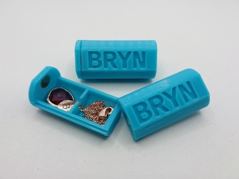
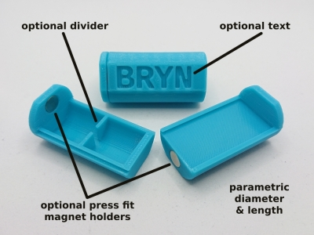
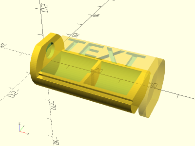

# Parametric Jewelry Box

<table>
<tr>
<td></td>
<td></td>
</tr>
<tr>
<td></td>
</tr>
</table>

A parametric jewelry box for a necklace, a pair of earrings, or other small items. Diameter, length, text, optional divider, and optional magnet holders are customizable parameters. Made with OpenSCAD.

**Design:** [jewelry_box.scad](jewelry_box.scad)

**STLs:**

* [jewelry_box_base.stl](stls/jewelry_box_base.stl)
* [jewelry_box_lid.stl](stls/jewelry_box_lid.stl)

**Recommended Print Settings:** 0.20mm layer height, 15-100% infill, no supports

**Thingiverse:** https://www.thingiverse.com/thing:4745578

**License**: 
